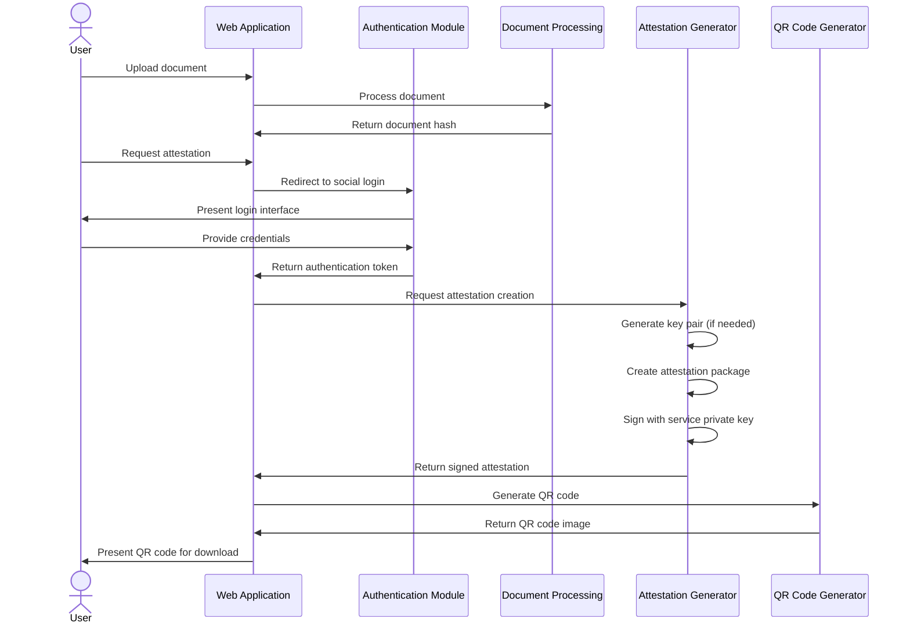
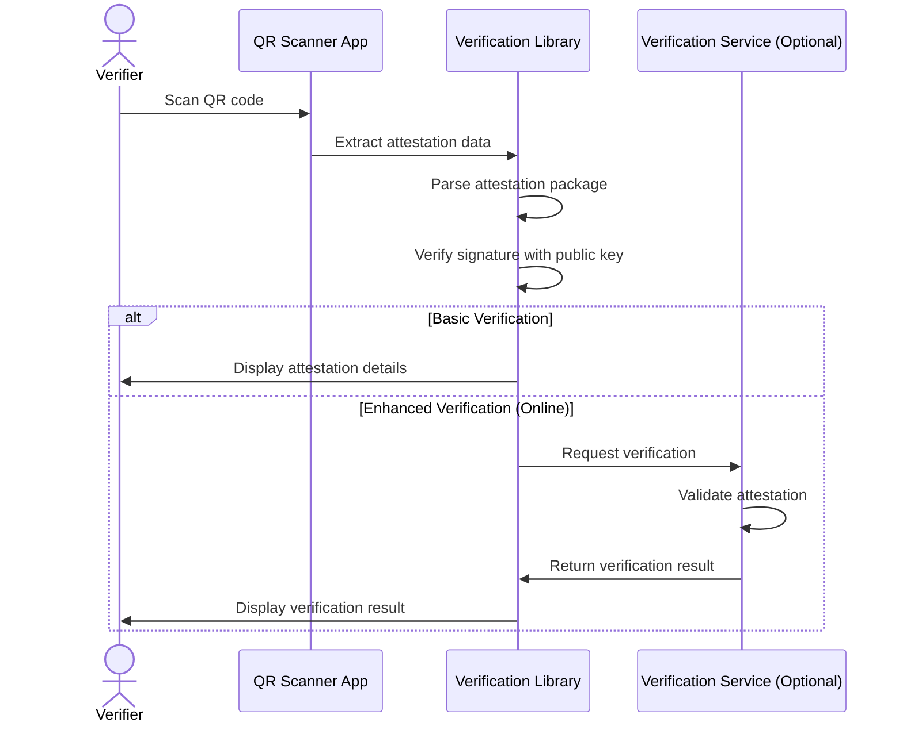
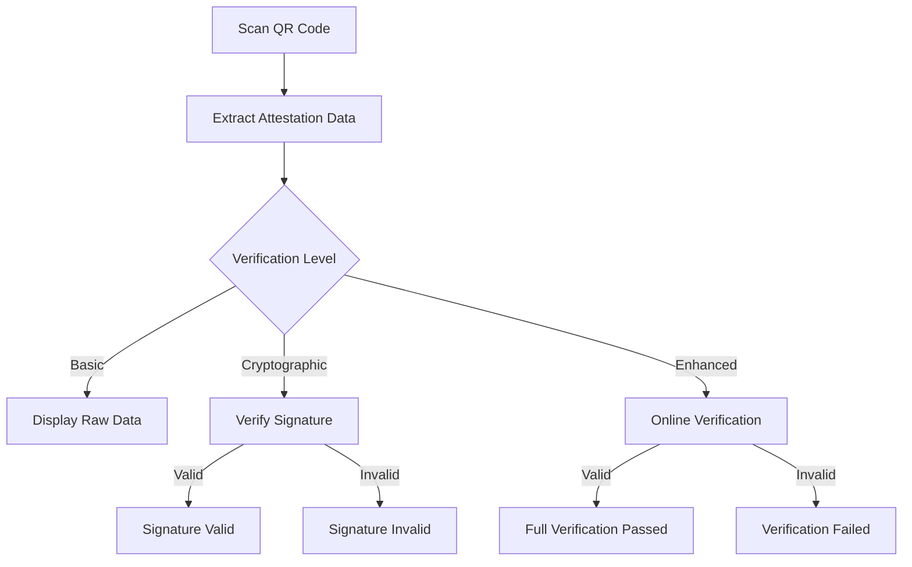
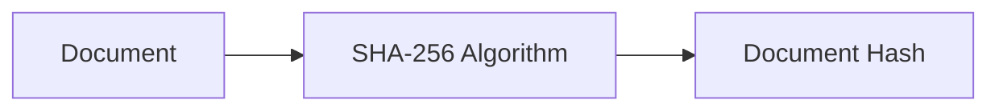
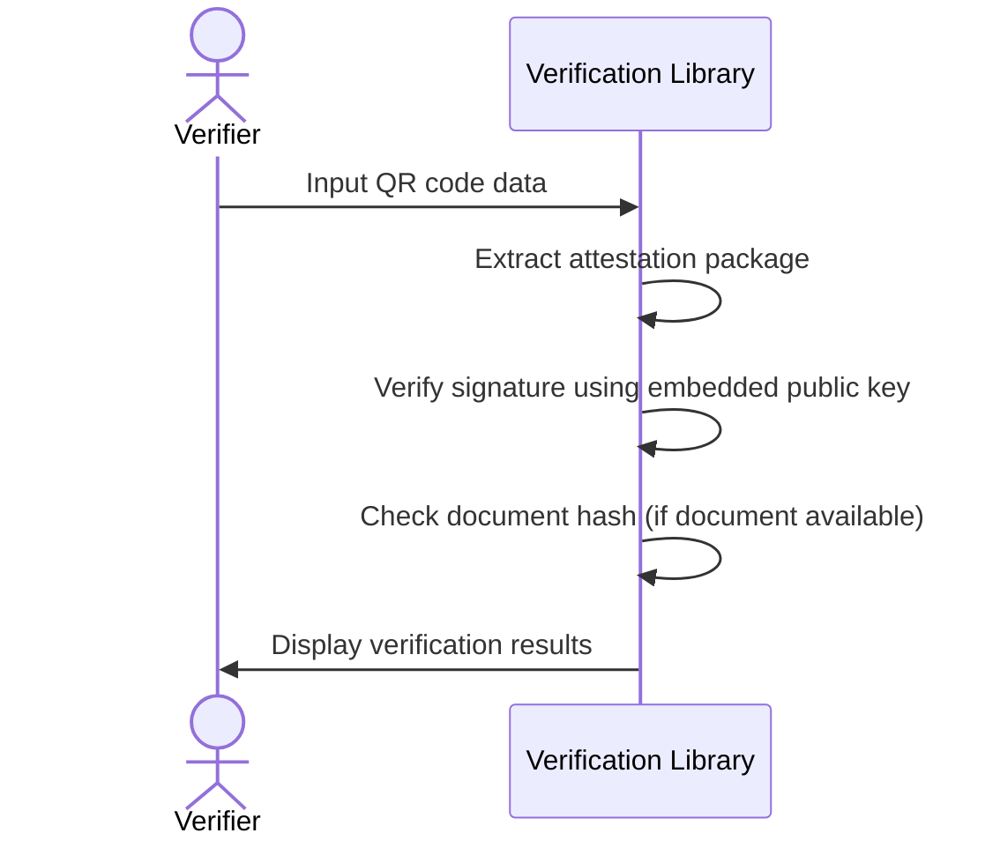
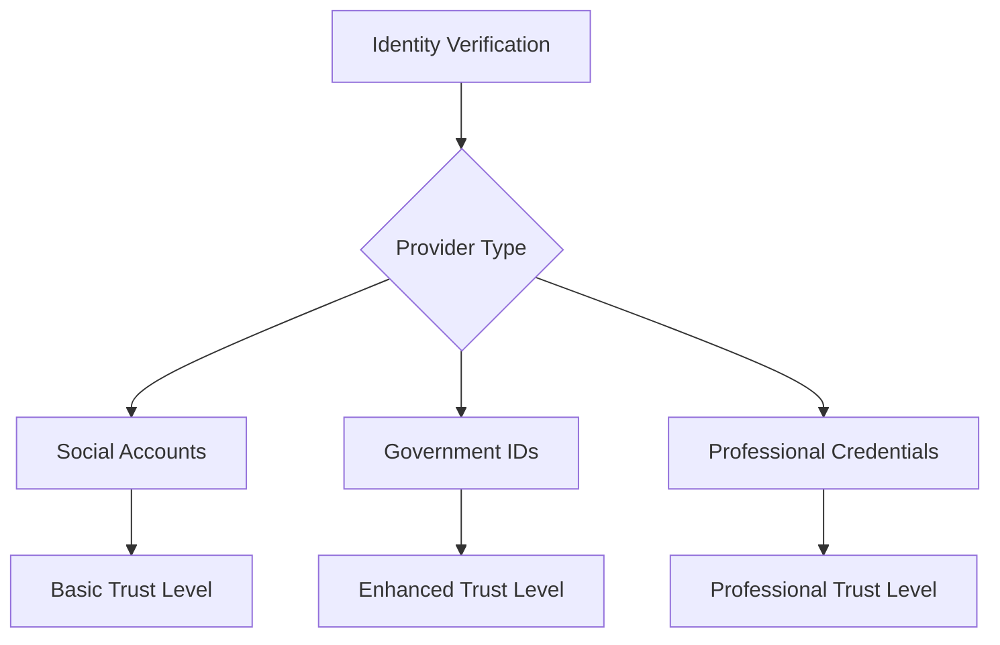
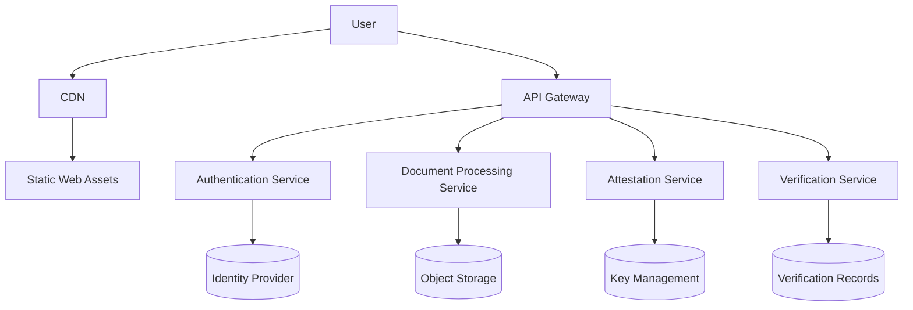

# Zign.codes Architecture

This document outlines the technical architecture of Zign.codes, a system for creating self-contained document attestations using social authentication.

## System Overview

Zign.codes is designed as a web application that allows users to create verifiable attestations of document ownership using their existing social identities. The system generates QR codes containing all necessary verification data, enabling offline verification without requiring continuous server availability.

## Core Components

1. **Web Application**: Frontend interface for document upload and attestation generation
2. **Authentication Module**: Handles social login integration
3. **Document Processing Engine**: Creates document hashes and manages file handling
4. **Attestation Generator**: Creates the signed attestation package
5. **QR Code Generator**: Encodes the attestation into a scannable format
6. **Verification Library**: Client-side code for verifying attestations
7. **Optional Verification Service**: Server endpoint for enhanced verification

## Data Flow

### Document Signing Process



### Verification Process



## Attestation Package Structure

The attestation package is the core data structure that gets encoded into the QR code. It contains all information needed for verification.

```json
{
  "version": "1.0",
  "documentHash": "sha256:e3b0c44298fc1c149afbf4c8996fb92427ae41e4649b934ca495991b7852b855",
  "timestamp": "2023-05-21T13:45:30Z",
  "identity": {
    "provider": "google",
    "identifier": "user@example.com",
    "displayName": "User Name"
  },
  "serviceInfo": {
    "name": "Zign.codes",
    "publicKeyId": "key-2023-05"
  },
  "signature": "base64-encoded-signature-data"
}
```

## Security Considerations

### Hybrid Verification Approach

Zign.codes uses a hybrid approach to verification:

1. **Self-contained verification**: The QR code contains all data needed for basic verification
2. **Cryptographic verification**: The attestation is signed by the service's private key
3. **Optional online verification**: Enhanced verification can be performed online

This approach provides flexibility while maintaining security:



### Key Management

The service uses asymmetric cryptography to sign attestations:

1. A private key is securely stored on the server
2. The corresponding public key is either:
   - Embedded in the attestation package
   - Referenced by ID and retrievable from a public key server
3. Keys are rotated periodically for security

## Technical Implementation Details

### Document Hash Generation

Documents are hashed using SHA-256 to create a unique fingerprint:



### QR Code Capacity Considerations

QR codes have limited data capacity:

- Version 1: ~20 bytes
- Version 25: ~2,000 bytes
- Version 40: ~3,000 bytes

To handle this limitation, the system:
1. Uses compact data formats
2. Implements data compression
3. For larger attestations, may split across multiple QR codes

### Offline Verification Process

The verification library is designed to work offline:



## Integration Capabilities

### Social Authentication Providers

The initial implementation supports these providers:
- Google
- Facebook
- Twitter/X
- GitHub
- Microsoft

### Future Identity Provider Integration

The system is designed to accommodate stronger identity verification methods:



## Deployment Architecture

Zign.codes is designed as a cloud-native application:



## Development Roadmap

1. **MVP Phase**:
   - Basic web application
   - Social authentication
   - QR code generation
   - Offline verification

2. **Enhancement Phase**:
   - Additional identity providers
   - Mobile applications
   - Document type-specific features
   - API for third-party integration

3. **Enterprise Phase**:
   - Organization accounts
   - Bulk processing
   - Advanced analytics
   - Custom branding
