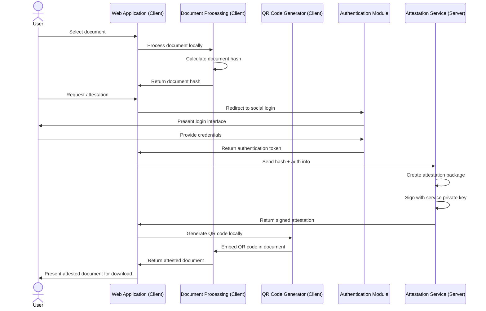
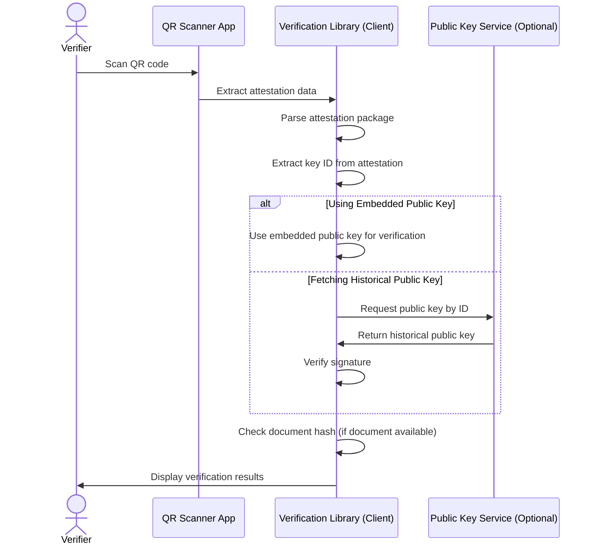
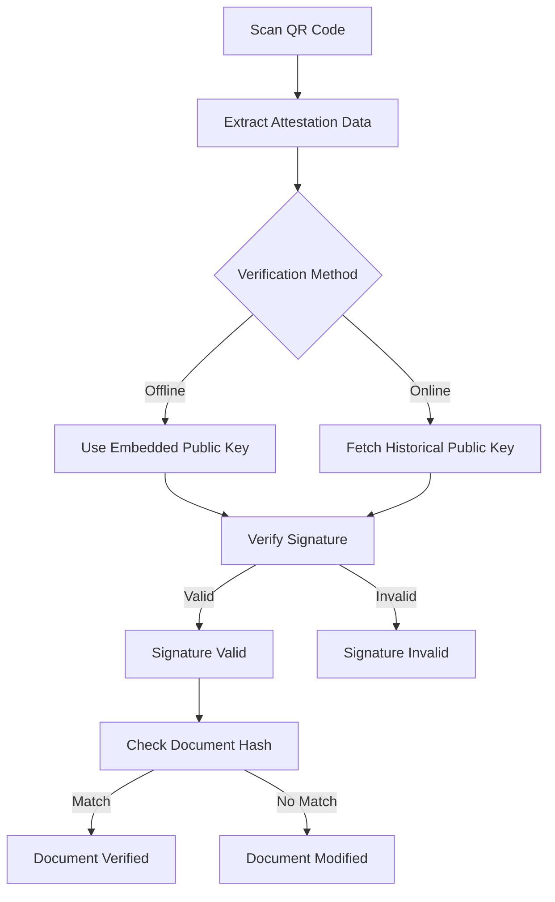
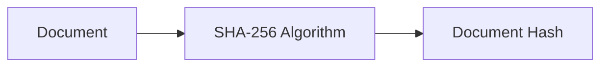
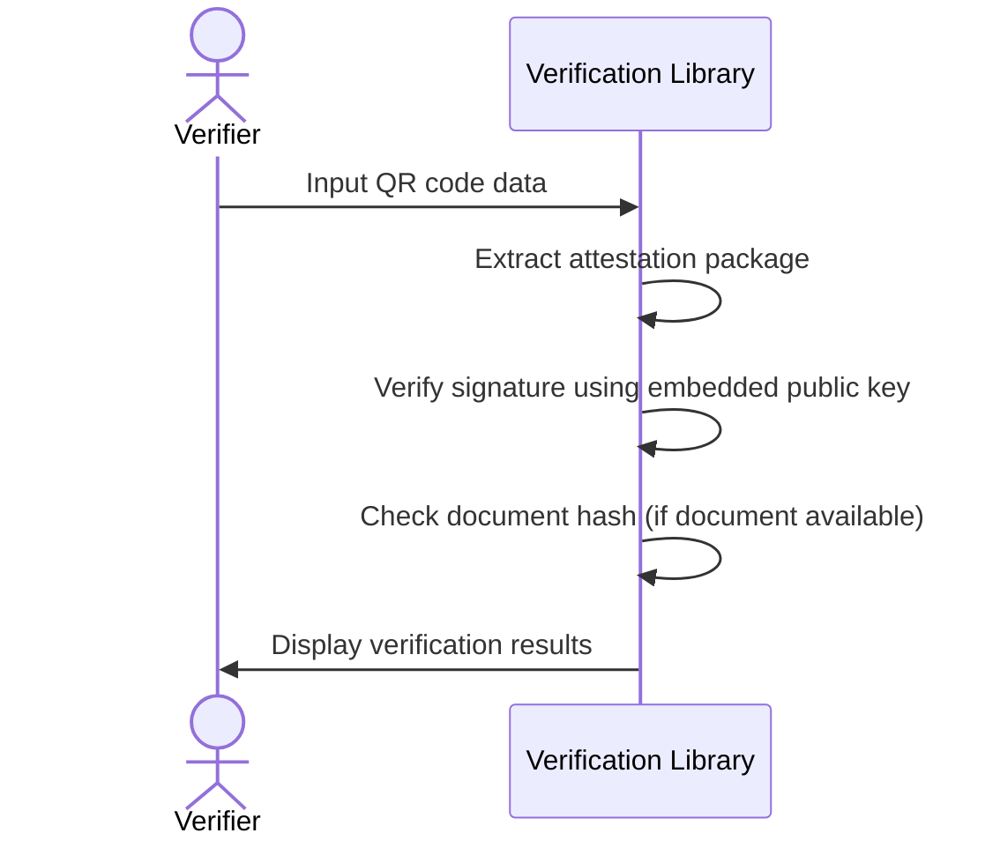
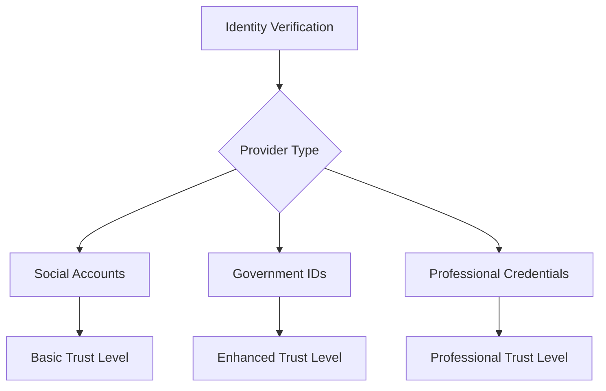
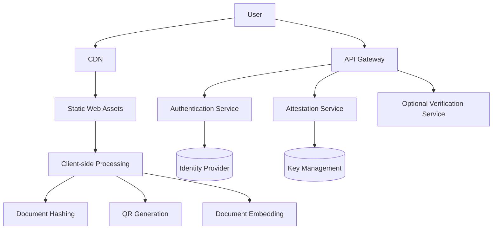

# Zign.codes Architecture

This document outlines the technical architecture of Zign.codes, a system for creating self-contained document attestations using social authentication.

## System Overview

Zign.codes is designed as a web application that allows users to create verifiable attestations of document ownership using their existing social identities. The system generates QR codes containing all necessary verification data, enabling offline verification without requiring continuous server availability.

## Core Components

1. **Web Application**: Frontend interface with client-side document processing
2. **Authentication Module**: Handles social login integration
3. **Attestation Service**: Server component that signs attestation data
4. **Client-side Libraries**:
   - Document Processing: Creates document hashes locally
   - QR Code Generator: Encodes and embeds attestations
   - Verification Library: Client-side code for verifying attestations
5. **Optional Verification Service**: Server endpoint for enhanced verification

## Data Flow

### Document Signing Process



### Verification Process



## Attestation Package Structure

The attestation package is the core data structure that gets encoded into the QR code. It contains all information needed for verification.

```json
{
  "version": "1.0",
  "documentHash": "sha256:e3b0c44298fc1c149afbf4c8996fb92427ae41e4649b934ca495991b7852b855",
  "timestamp": "2023-05-21T13:45:30Z",
  "identity": {
    "provider": "google",
    "identifier": "user@example.com",
    "displayName": "User Name"
  },
  "serviceInfo": {
    "name": "Zign.codes",
    "publicKeyId": "key-2023-05"
  },
  "publicKey": "base64-encoded-public-key-data",
  "signature": "base64-encoded-signature-data"
}
```

The inclusion of the `publicKeyId` allows for fetching the correct historical public key when online verification is available, while the embedded `publicKey` enables completely offline verification.

## Privacy and Security Principles

Zign.codes is designed with privacy as a core principle:

1. **Client-side Document Processing**: 
   - Documents never leave the user's device
   - All document hashing and preparation is done in the browser
   - Only the document hash is sent to the server, never the document itself

2. **Minimal Data Collection**:
   - The server only receives the document hash and authentication information
   - No document content is stored on the server
   - User identity information is only used for attestation purposes

3. **Transparent Data Flow**:
   - Users can see exactly what information is included in the attestation
   - The attestation process is fully transparent to the user

4. **Local Document Modification**:
   - QR code embedding happens entirely on the client side
   - The server never sees or processes the final document

## Security Considerations

### Hybrid Verification Approach

Zign.codes uses a self-contained verification approach:

1. **Self-contained verification**: The QR code contains all data needed for basic verification
2. **Cryptographic verification**: The attestation is signed by the service's private key
3. **Public key verification**: Verification can use either the embedded public key or fetch the historical key that was valid at signing time

This approach provides flexibility while maintaining security:



### Key Management

The service uses asymmetric cryptography to sign attestations:

1. **Server-side Storage Requirements**:
   - Private keys are securely stored on the server
   - Key metadata (creation date, expiration date, key ID)
   - No document content or attestation records are stored

2. **Public Key Distribution**:
   - The corresponding public key is embedded in the attestation package
   - Public keys are also available via a simple public endpoint

3. **Key Rotation**:
   - Keys are rotated periodically for security
   - Historical public keys remain available for verification of older attestations

## Technical Implementation Details

### Document Hash Generation

Documents are hashed using SHA-256 to create a unique fingerprint:



### QR Code Capacity Considerations

QR codes have limited data capacity:

- Version 1: ~20 bytes
- Version 25: ~2,000 bytes
- Version 40: ~3,000 bytes

To handle this limitation, the system:
1. Uses compact data formats
2. Implements data compression
3. For larger attestations, may split across multiple QR codes

### Offline Verification Process

The verification library is designed to work offline:



## Integration Capabilities

### Social Authentication Providers

The initial implementation supports these providers:
- Google
- Facebook
- Twitter/X
- GitHub
- Microsoft

### Future Identity Provider Integration

The system is designed to accommodate stronger identity verification methods:



## Deployment Architecture

Zign.codes is designed as a privacy-focused, client-heavy application:



This architecture ensures:
1. Document content remains on the client device
2. Server only handles authentication and signing
3. Minimal server-side processing and storage
4. Reduced privacy and security concerns

## Server-Side Data Storage

Zign.codes maintains minimal server-side data:

1. **Private Keys and Key Management**:
   - Private keys used for signing attestations
   - Key rotation history and validity periods
   - This is the only critical persistent data

2. **Authentication Integration**:
   - Configuration for social identity providers
   - No user credentials are stored

3. **No Document Storage**:
   - No document content is ever stored
   - No document hashes are persisted after signing
   - No attestation records are maintained

This minimal approach to data storage enhances privacy and security while reducing compliance requirements.

## Development Roadmap

1. **MVP Phase**:
   - Basic web application
   - Social authentication
   - QR code generation
   - Offline verification

2. **Enhancement Phase**:
   - Additional identity providers
   - Mobile applications
   - Document type-specific features
   - API for third-party integration

3. **Enterprise Phase**:
   - Organization accounts
   - Bulk processing
   - Advanced analytics
   - Custom branding
