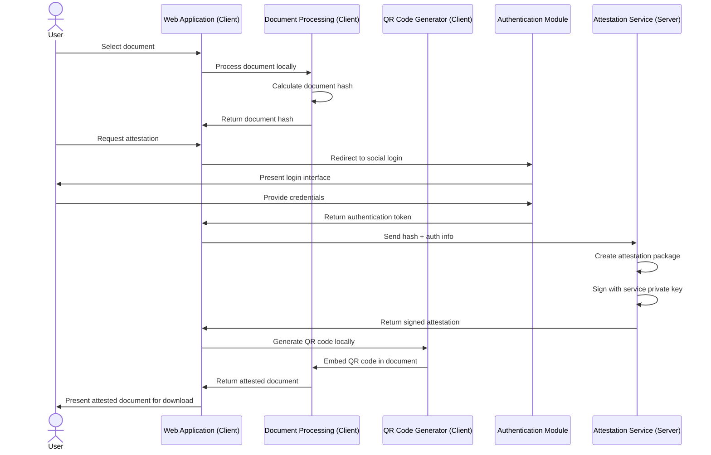
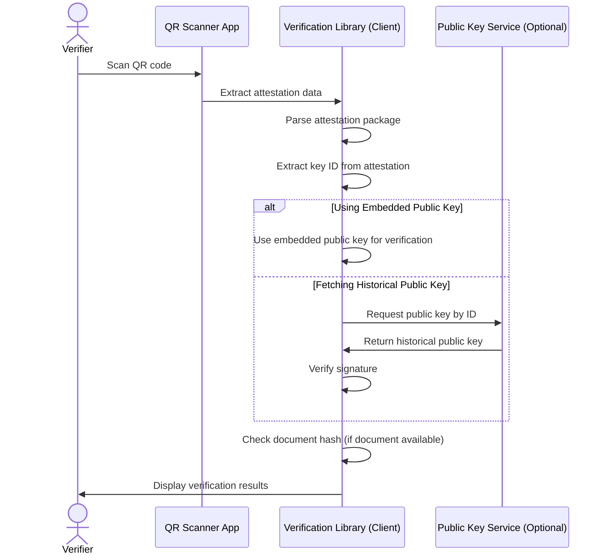
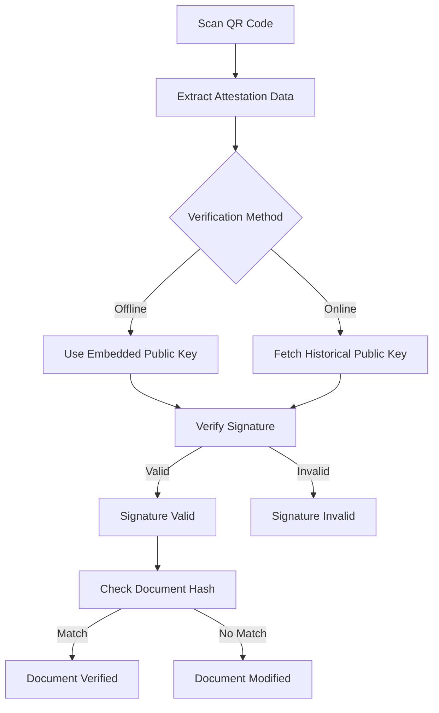
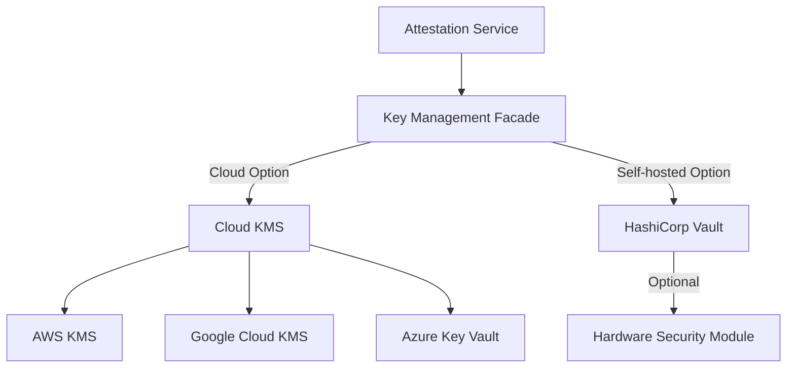
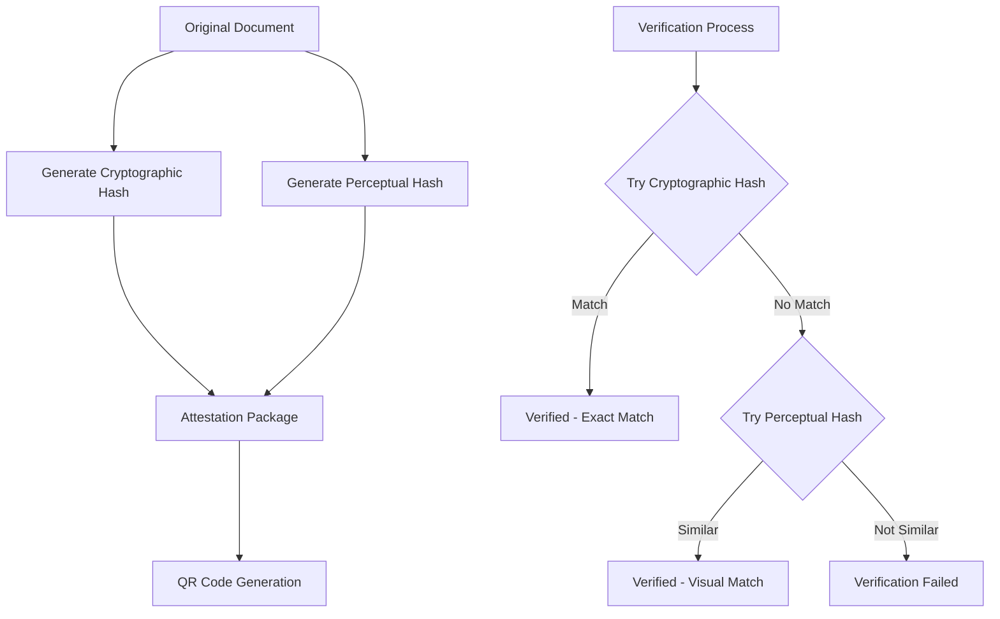
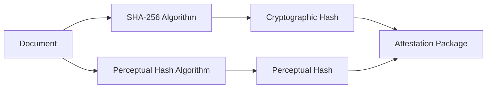
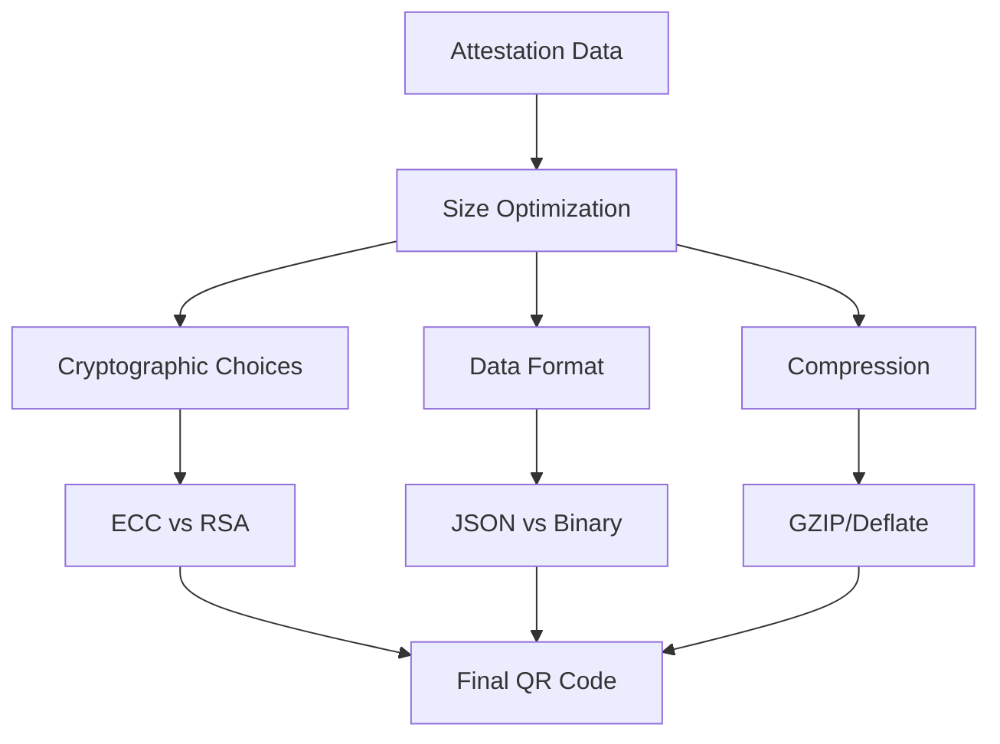
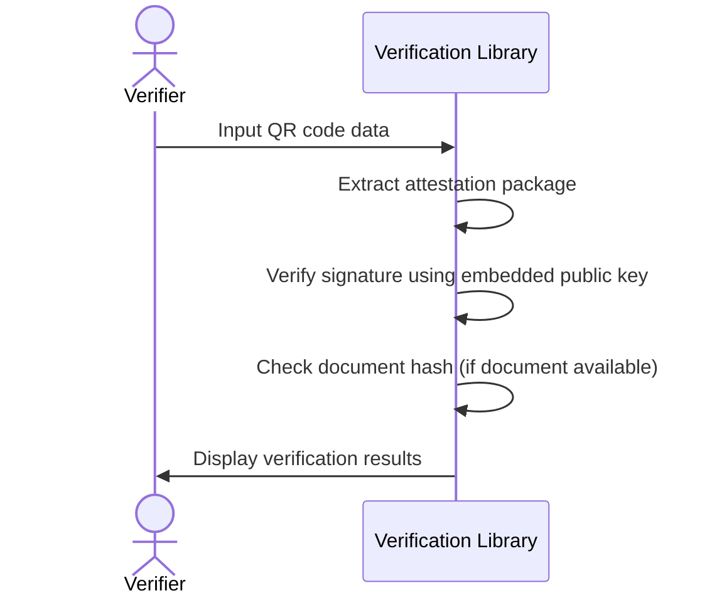
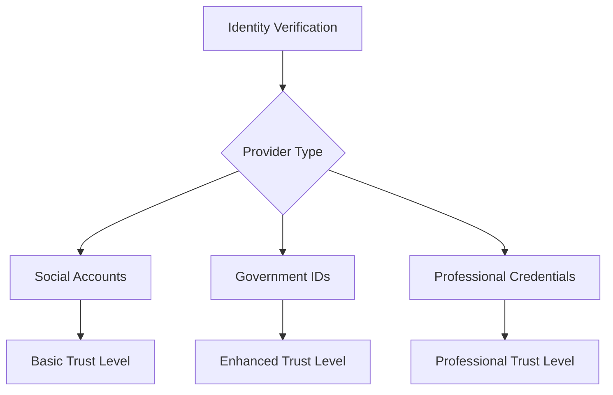
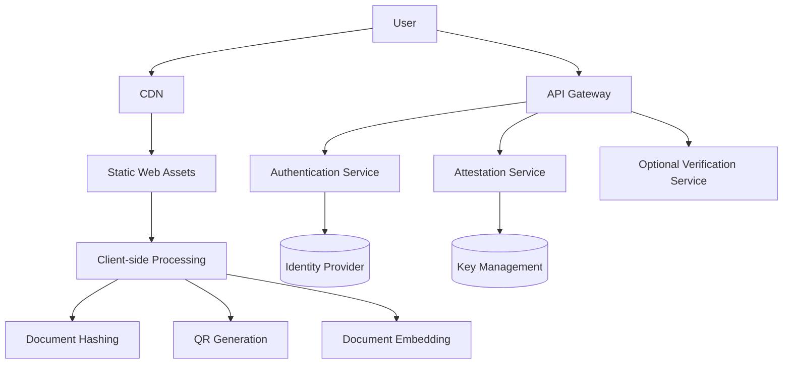

# seal.codes Architecture

This document outlines the technical architecture of seal.codes, a system for creating self-contained document attestations using social authentication.

## System Overview

seal.codes is designed as a web application that allows users to create verifiable attestations of document ownership using their existing social identities. The system generates QR codes containing all necessary verification data, enabling offline verification without requiring continuous server availability.

## Core Components

1. **Web Application**: Frontend interface with client-side document processing
2. **Authentication Module**: Handles social login integration
3. **Attestation Service**: Server component that signs attestation data
4. **Client-side Libraries**:
   - Document Processing: Creates document hashes locally
   - QR Code Generator: Encodes and embeds attestations
   - Verification Library: Client-side code for verifying attestations
5. **Optional Verification Service**: Server endpoint for enhanced verification

## Data Flow

### Document Signing Process



### Verification Process



## Attestation Package Structure

The attestation package is the core data structure that gets encoded into the QR code. It contains all information needed for verification.

```json
{
  "version": "1.0",
  "hashes": {
    "crypto": "sha256:e3b0c44298fc1c149afbf4c8996fb92427ae41e4649b934ca495991b7852b855",
    "perceptual": "phash:9d2723e6a0d3c8b5"
  },
  "timestamp": "2023-05-21T13:45:30Z",
  "identity": {
    "provider": "google",
    "identifier": "user@example.com",
    "displayName": "User Name"
  },
  "serviceInfo": {
    "name": "seal.codes",
    "publicKeyId": "key-2023-05"
  },
  "publicKey": "base64-encoded-public-key-data",
  "signature": "base64-encoded-signature-data"
}
```

The attestation package includes:
- Multiple hash types for resilient verification
- Timestamp of when the attestation was created
- Identity information from the social authentication
- Service information and key identifiers
- The public key for offline verification
- A cryptographic signature of all the above data

## Privacy and Security Principles

seal.codes is designed with privacy as a core principle:

1. **Client-side Document Processing**: 
   - Documents never leave the user's device
   - All document hashing and preparation is done in the browser
   - Only the document hash is sent to the server, never the document itself

2. **Minimal Data Collection**:
   - The server only receives the document hash and authentication information
   - No document content is stored on the server
   - User identity information is only used for attestation purposes

3. **Transparent Data Flow**:
   - Users can see exactly what information is included in the attestation
   - The attestation process is fully transparent to the user

4. **Local Document Modification**:
   - QR code embedding happens entirely on the client side
   - The server never sees or processes the final document

## Security Considerations

### Hybrid Verification Approach

seal.codes uses a self-contained verification approach:

1. **Self-contained verification**: The QR code contains all data needed for basic verification
2. **Cryptographic verification**: The attestation is signed by the service's private key
3. **Public key verification**: Verification can use either the embedded public key or fetch the historical key that was valid at signing time

This approach provides flexibility while maintaining security:



## Key Management Architecture

seal.codes uses a flexible key management architecture that prioritizes security while allowing for different deployment options:



### Key Management Facade

The system implements a key management facade that abstracts the underlying key storage and signing operations:

1. **Provider-Agnostic Interface**:
   - Consistent API for key operations regardless of backend
   - Easy switching between providers
   - Support for multiple active providers

2. **Operations Supported**:
   - Key generation
   - Data signing
   - Signature verification
   - Key rotation
   - Key metadata management

### Cloud KMS Options

For production deployments, cloud KMS services offer the highest security with minimal operational overhead:

1. **AWS KMS**:
   - FIPS 140-2 Level 3 compliance
   - Automatic key rotation
   - Fine-grained IAM controls

2. **Google Cloud KMS**:
   - HSM protection
   - Centralized management
   - Detailed audit logging

3. **Azure Key Vault**:
   - Managed HSM service
   - Integrated with Azure identity

### Self-Hosted Option

For complete control or specific compliance requirements, a self-hosted option is available:

1. **HashiCorp Vault**:
   - Open-source key management
   - Flexible deployment options
   - Transit secrets engine for encryption operations
   - Support for auto-unsealing

2. **Optional HSM Integration**:
   - YubiHSM for affordable hardware protection
   - Thales Luna for enterprise-grade security
   - PKCS#11 interface for standardized integration

### Security Considerations

Regardless of the chosen backend, the key management system implements:

1. **Defense in Depth**:
   - Multiple layers of access controls
   - Network isolation for key operations
   - Principle of least privilege

2. **Operational Security**:
   - Regular key rotation
   - Comprehensive audit logging
   - Alerting on unusual activities

3. **Disaster Recovery**:
   - Secure backup procedures
   - Tested recovery processes
   - Geographic redundancy

### Public Key Distribution

- The corresponding public key is embedded in the attestation package
- Public keys are also available via a simple public endpoint
- Historical public keys remain available for verification of older attestations

## Resilience to Image Compression and Metadata Loss

A significant challenge for document attestation systems is maintaining verification integrity when images are shared across platforms that modify content through compression or strip metadata. seal.codes addresses this challenge through a multi-layered hash approach.

### Multi-Layered Hash Strategy



#### 1. Cryptographic Hash Layer

The primary verification method uses traditional cryptographic hashes (SHA-256):

- **Purpose**: Provides cryptographic certainty for unmodified documents
- **Characteristics**: Changes completely with any modification to the document
- **Use Case**: Verification of original, uncompressed documents

#### 2. Perceptual Hash Layer

A secondary verification method uses perceptual hashing algorithms:

- **Purpose**: Provides resilience against compression and minor modifications
- **Characteristics**: Remains similar even when the image is compressed or resized
- **Algorithms**: pHash (Perceptual Hash), dHash (Difference Hash), or aHash (Average Hash)
- **Use Case**: Verification of documents shared through platforms that compress content

### Verification Process with Multi-Layered Hashing

1. **Extract both hashes** from the attestation package
2. **Primary verification**: Compare the cryptographic hash of the document with the stored hash
3. **If primary verification fails**: Calculate the perceptual hash of the document and compare with the stored perceptual hash
4. **Apply similarity threshold**: If the perceptual hash similarity exceeds the defined threshold (e.g., 90%), consider the document verified
5. **Provide verification details**: Inform the user whether verification was exact (cryptographic) or approximate (perceptual)

### Strategies for Metadata Preservation

In addition to the multi-layered hash approach, seal.codes implements several strategies to maximize the chances of metadata preservation:

1. **Redundant Storage**:
   - Store attestation data in multiple metadata fields (EXIF, XMP, IPTC)
   - Include minimal attestation data in the visible QR code

2. **Platform-Specific Optimizations**:
   - Detect common platforms and apply optimizations for each
   - Provide guidance to users on platform-specific sharing methods

3. **User Education**:
   - Clear communication about which platforms preserve metadata
   - Instructions for preserving image integrity when sharing

### Implementation Considerations

1. **Perceptual Hash Selection**:
   - Different perceptual hash algorithms have different strengths
   - pHash is generally more robust but computationally intensive
   - dHash is faster but less robust to certain transformations

2. **Threshold Calibration**:
   - Similarity thresholds need careful calibration
   - Too strict: Legitimate compressed images fail verification
   - Too lenient: Risk of false positives

3. **Performance Optimization**:
   - Perceptual hash calculation can be resource-intensive
   - Client-side implementation needs optimization for browser performance
   - Consider using WebAssembly for complex hash calculations

## Technical Implementation Details

### Document Hash Generation

seal.codes uses a multi-layered hash approach to balance security with resilience to modifications:



1. **Cryptographic Hash (SHA-256)**:
   - Provides cryptographic certainty for unmodified documents
   - Changes completely with any modification to the document
   - Primary verification method for exact matching

2. **Perceptual Hash (pHash/dHash)**:
   - Provides resilience against compression and minor modifications
   - Remains similar even when the image is compressed or resized
   - Secondary verification method using similarity thresholds

### QR Code Capacity and Optimization

QR codes have limited data capacity that must be considered when designing the attestation package:



#### Size Analysis

| Component | RSA 2048 Size | ECC (Ed25519) Size |
|-----------|---------------|-------------------|
| Public Key (base64) | ~400 bytes | ~64 bytes |
| Signature (base64) | ~400 bytes | ~128 bytes |
| Crypto Hash | ~50 bytes | ~50 bytes |
| Perceptual Hash | ~50 bytes | ~50 bytes |
| Identity Data | ~150 bytes | ~150 bytes |
| Timestamp & Metadata | ~100 bytes | ~100 bytes |
| **Total (uncompressed)** | **~1,150 bytes** | **~542 bytes** |
| **Total (compressed)** | **~800 bytes** | **~400 bytes** |

#### QR Code Version Requirements

| QR Version | Max Capacity | Scanability | Sufficient For |
|------------|--------------|-------------|---------------|
| Version 10 | ~300 bytes | Excellent | Not sufficient |
| Version 20 | ~1,000 bytes | Good | ECC with compression |
| Version 25 | ~1,500 bytes | Moderate | RSA with compression |
| Version 30 | ~2,000 bytes | Fair | Uncompressed data |
| Version 40 | ~3,000 bytes | Poor | All scenarios but not recommended |

#### Optimization Strategies

1. **Cryptographic Algorithm Selection**:
   - **Recommended**: Elliptic Curve Cryptography (Ed25519)
     - 32-byte public keys (64 bytes base64)
     - 64-byte signatures (128 bytes base64)
     - Strong security with minimal size
   - **Alternative**: RSA with 2048-bit keys
     - Larger keys and signatures
     - More widely supported in some environments

2. **Data Format Optimization**:
   - **Compact Field Names**: Use short property names in JSON
   - **Binary Formats**: Consider CBOR or MessagePack instead of JSON
   - **Structured Encoding**: Use nested structures efficiently

3. **Compression Techniques**:
   - Apply GZIP/Deflate compression to the attestation package
   - Typical compression ratio: 30-50% size reduction
   - Decompress on the client side before verification

4. **QR Code Error Correction Level**:
   - Balance between error correction and data capacity
   - Recommendation: Use Medium (M) level for optimal balance

With these optimizations, the attestation package (including both cryptographic and perceptual hashes) can fit comfortably within a Version 20-25 QR code, which maintains good scannability while containing all necessary verification data.

### Offline Verification Process

The verification library is designed to work offline:



## Integration Capabilities

### Social Authentication Providers

The initial implementation supports these providers:
- Google
- Facebook
- Twitter/X
- GitHub
- Microsoft

### Future Identity Provider Integration

The system is designed to accommodate stronger identity verification methods:



## Deployment Architecture

seal.codes is designed as a privacy-focused, client-heavy application:



This architecture ensures:
1. Document content remains on the client device
2. Server only handles authentication and signing
3. Minimal server-side processing and storage
4. Reduced privacy and security concerns

## Server-Side Data Storage

seal.codes maintains minimal server-side data:

1. **Private Keys and Key Management**:
   - Private keys used for signing attestations
   - Key rotation history and validity periods
   - This is the only critical persistent data

2. **Authentication Integration**:
   - Configuration for social identity providers
   - No user credentials are stored

3. **No Document Storage**:
   - No document content is ever stored
   - No document hashes are persisted after signing
   - No attestation records are maintained

This minimal approach to data storage enhances privacy and security while reducing compliance requirements.

## Development Roadmap

1. **MVP Phase**:
   - Basic web application
   - Social authentication
   - QR code generation
   - Offline verification

2. **Enhancement Phase**:
   - Additional identity providers
   - Mobile applications
   - Document type-specific features
   - API for third-party integration

3. **Enterprise Phase**:
   - Organization accounts
   - Bulk processing
   - Advanced analytics
   - Custom branding
